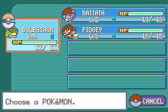

## Move Item

Black and White 2 introduced a feature where you can move items directly between two Pokémon in your party from within the party menu, rather than having to use the bag as middle man. This ports that feature to FR ROMs.



### Build Instructions

See [here](https://gist.github.com/Zeturic/db1611cc7b17c3140f9b9af32e1b596b) for the prequisites and help in installing them.

#### Cloning the repo

Open your terminal to whatever folder you want to download this repo into. Then, do the following to download the repo and build the included tools:

```shell
$ git clone https://github.com/Zeturic/bpre-move-item.git
$ cd bpre-move-item
```

#### Adding your ROM

Copy your ROM to this directory and rename it `rom.gba`.

#### Repointing sCursorOptions

Every cursor option in the party menu (`SUMMARY`, `TAKE`, `CUT`, etc) has an associated entry in `sCursorOptions`. We're adding a new cursor option, `MOVE`, so we'll need to repoint `sCursorOptions` and add the new entry. However, we can't just repoint it the normal way. Repointing it and adding the entry for `MENU` at the end would cause it to treat `MENU` as a field move, causing some weird bugs.

Repointing it properly is somewhat involved, so `repoint-cursor-options.asm` is included to do it for you. You'll need to modify it slightly, however.

Open `repoint-cursor-options.asm` in the text editor of your choice.

Modify the definition of `free_space`. The table will be repointed to wherever you specify, so make sure it's actually free space in your ROM. Look for `0x100` bytes of free space from a word aligned address (read: an address ending in `0`, `4`, `8`, or `C`).

By default, FR has `12` field moves. If you've previously expanded them - for example, to add Rock Climb - update the definition of `NUM_FIELD_MOVE_CURSOR_OPTIONS`.

Once you're done modifying it, save it and return to the terminal and run:

```shell
$ make repoint-cursor-options
```

Your ROM will be modified in place, and it'll give you output describing what it did. It'll also give you a value for `MENU_MOVE_ITEM`, though it should always be `0x12`.

#### Building the project itself

Unlike in the previous step, the build system is smart enough to find enough free space on its own.

However, if you want the code to be inserted at a particular address, you can specify it by updating the definition of `START_AT` in `config.mk`; if the given address is acceptable (i.e. is word-aligned and has enough bytes of free space), it will be inserted there. Otherwise, it will just use `START_AT` to determine where in the ROM it should start looking for free space.

If you want to edit the strings involved in this feature - for example, to decapitalize `MOVE` to `Move` - they can be found and modified in `src/strings.c`.

Once you're ready, run the following to build the project:

```shell
make
```

Also unlike the previous step, this won't actually modify `rom.gba`, instead your output will be in `test.gba`. Naturally, test it in an emulator.

### Credits

The project structure and some of the build tools are from [pokeemerald](https://github.com/pret/pokeemerald).
